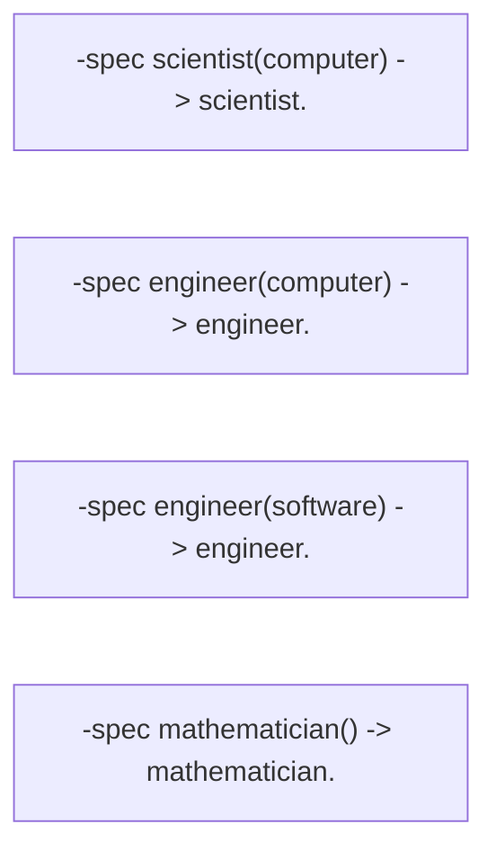

# Guilherme Silva

```mermaid
flowchart TB
    a["-spec scientist(computer) -> scientist."]
    b["-spec engineer(computer) -> engineer."]
    c["-spec engineer(software) -> engineer."]
    d["-spec mathematician() -> mathematician."]
    a ~~~ b ~~~ c ~~~ d
```
